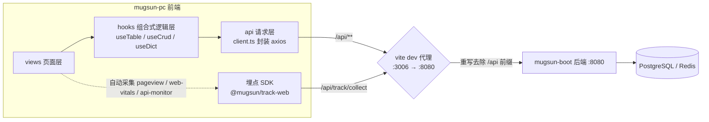

# mugsun-pc

[English](./README_EN.md) | 简体中文

mugsun 低代码平台的 PC 管理前端 —— 基于 Vue 3 + TypeScript + Vite + Element Plus，覆盖系统管理、低代码、工作流、监控、开放平台、埋点看板、租户运营等 60+ 页面的完整管理端。

[](https://vuejs.org/) [](https://www.typescriptlang.org/) [](https://vite.dev/) [](https://element-plus.org/) [](https://pnpm.io/) [](./LICENSE)

## ✨ 特性

- **服务端菜单驱动**：侧边栏由后端菜单树实时渲染，角色授权 / 隐藏菜单一刷新生效；`v-perm` 指令 + `hasPerm` 实现按钮级权限门控
- **组合式 CRUD 体系**：`useTable` / `useCrud` / `useDict`（字典并发去重、标签着色）、表格自定义列持久化，业务页面少写样板代码
- **低代码表单**：form-create 设计器 + 运行时渲染深度集成，表单即配即用
- **自监控埋点**：`@mugsun/track-web` SDK 全局挂接，pageview / pageleave / web-vitals / error / 接口监控 / 曝光 / 圈选 / 会话回放全自动上报，启停由后端配置下发
- **实时消息**：WebSocket 长连接推送（铃铛角标、强制下线），开发代理原生支持 `ws`
- **安全登录**：SM2 国密算法加密登录传输
- **中英双语**：vue-i18n 驱动，界面语言一键切换
- **契约同步**：`pnpm gen:api` 一条命令从后端 OpenAPI 重新生成 TypeScript 契约，前后端类型零漂移
- **真实端到端测试**：Playwright 套件走真实浏览器 + 真实验证码流程，不做表面冒烟

## 🧱 架构与数据流

页面不直接碰 HTTP —— 请求沿「页面 → hooks → api → 后端」分层流动，埋点 SDK 经同一代理旁路上报：



## 🚀 快速开始

环境要求：**Node.js ≥ 20.19**，**pnpm ≥ 8.8**（仓库锁定 `pnpm@11.9.0`，推荐 `corepack enable` 自动对齐）。

本仓与平台其余三仓配套工作，请**平级 clone**：

```
mugsun/
├── mugsun-core     # 后端核心依赖
├── mugsun-boot     # 后端服务（:8080）
├── mugsun-pc       # 本仓（管理前端）
└── mugsun-track    # 埋点 SDK
```

> ⚠️ **上手必读**：本仓以 `file:../mugsun-track` 协议依赖埋点 SDK，其 `dist/` 不随仓库分发。直接 `pnpm install && pnpm dev` 会报模块找不到——**必须先构建一次 SDK**：

```bash
# 1. 构建本地埋点 SDK（仅首次 / SDK 更新后需要）
cd ../mugsun-track
pnpm install && pnpm build

# 2. 回到本仓，安装依赖并启动
cd ../mugsun-pc
pnpm install
pnpm dev
```

启动后自动打开 http://localhost:3006 （端口取 `.env` 的 `VITE_PORT`，当前 **3006**）。

开发联调无 mock：`/api/**` 请求全部由 vite 代理转发到本地后端 `http://localhost:8080`（见 `.env.development` 的 `VITE_API_PROXY_URL`），请先启动 mugsun-boot。

## 📜 常用脚本

| 命令 | 说明 |
| --- | --- |
| `pnpm dev` | 启动开发服务器（`vite --open`，端口 3006） |
| `pnpm dev:e2e` | 另起一个 3007 端口的独立实例，专供 e2e，不占用日常 dev |
| `pnpm build` | `vue-tsc` 全量类型检查 + 生产构建 |
| `pnpm serve` | `vite preview` 预览构建产物（沿用同一 `/api` 代理） |
| `pnpm gen:api` | 从后端 `http://localhost:8080/v3/api-docs` 重新生成 `src/types/api/openapi.d.ts` |
| `pnpm test:e2e` | 运行 Playwright 端到端套件 |
| `pnpm lint` / `pnpm fix` | ESLint 检查 / 自动修复 |
| `pnpm lint:prettier` | Prettier 格式化 |
| `pnpm lint:stylelint` | Stylelint 检查并修复样式 |
| `pnpm lint:lint-staged` | 对已暂存文件执行 lint-staged |
| `pnpm commit` | git-cz 交互式规范化提交 |
| `pnpm clean:dev` | 清理模板自带的示例路由 / 页面 / 文案，便于二次开发 |

其中 `gen:api` 值得单独一说：后端接口契约变更后，只需保证后端在 :8080 运行，执行一次 `pnpm gen:api`，全套 TypeScript 类型即同步到最新——杜绝前后端「口头契约」漂移。

## 🧪 端到端测试

`playwright.config.ts` 默认 `baseURL` 为 **http://localhost:3007**，刻意与日常 dev（3006）隔离：e2e 使用独立实例，互不干扰。

```bash
# 前置：mugsun-boot(:8080) 已启动，PostgreSQL（容器名 mugsun-pg）/ Redis（blade-redis）在跑
pnpm setup:sdk      # 等价于先构建 ../mugsun-track（首次必做）
pnpm dev:e2e        # 终端 A：起 3007 独立实例
pnpm test:e2e       # 终端 B：跑全量套件（串行；含 w14 流程 / w15 租户 / w16 OAuth 等）
```

登录用例走真实验证码流程：测试经 `docker exec <redis 容器> redis-cli` 读取后端写入 Redis 的图形验证码答案，不绕过后端校验。容器名与库号可用环境变量 `E2E_REDIS_CONTAINER` / `E2E_REDIS_DB`（默认 3）覆盖。

## 🗂 目录结构

```
src/
├── api/          # 按后端模块划分的请求层（client.ts 统一封装 axios）
├── assets/       # 样式 / 图片 / 图标资源
├── components/   # core 通用组件 + business 业务组件
├── config/       # 全局站点与主题配置
├── directives/   # 自定义指令（v-perm 按钮级权限等）
├── enums/        # 全局枚举
├── hooks/        # 组合式逻辑（useTable / useCrud / useDict …）
├── locales/      # vue-i18n 语言包（langs/zh.json、langs/en.json）
├── plugins/      # 插件挂接（埋点 SDK setupTrack 等）
├── router/       # 路由：guards 守卫 + 静态路由 + 后端菜单动态注册
├── store/        # Pinia 状态（user / menu / dict / setting / worktab / message …）
├── types/        # TS 类型（api/openapi.d.ts 由 gen:api 生成，请勿手改）
├── utils/        # 工具函数与 http 封装
└── views/        # 页面（system / dashboard / track / auth …）
```

## 🌍 国际化

语言包位于 `src/locales/langs/{zh,en}.json`，由 vue-i18n 加载，界面语言可在运行时切换；Element Plus 组件库文案随语言联动。

## ⭐ Star History

[](https://star-history.com/#mugsun/mugsun-pc&Date)

## 📄 许可证

本项目基于 [MIT License](./LICENSE) 开源。

---

本仓是 mugsun 低代码平台的管理前端，需与后端服务 mugsun-boot 配套运行；埋点能力由同平台的 mugsun-track SDK 提供。欢迎提交 Issue 与 PR——如果这个项目对你有帮助，欢迎点个 Star ⭐
