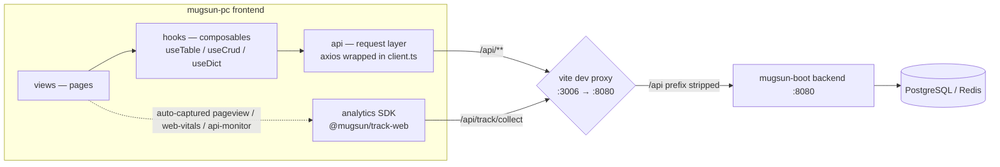

# mugsun-pc

English | [简体中文](./README.md)

The PC admin frontend of the mugsun low-code platform — built with Vue 3 + TypeScript + Vite + Element Plus, shipping 60+ pages across system administration, low-code tooling, workflow, monitoring, open platform, analytics dashboards, and tenant operations.

[](https://vuejs.org/) [](https://www.typescriptlang.org/) [](https://vite.dev/) [](https://element-plus.org/) [](https://pnpm.io/) [](./LICENSE)

## ✨ Highlights

- **Server-driven menus**: the sidebar renders straight from the backend menu tree — role grants and hidden menus take effect on refresh. Button-level permission gating via the `v-perm` directive and `hasPerm`
- **Composable CRUD toolkit**: `useTable` / `useCrud` / `useDict` (deduplicated concurrent dictionary loads, colored tags), persisted custom table columns — far less boilerplate per business page
- **Low-code forms**: form-create designer + runtime renderer deeply integrated, so forms are configured, not coded
- **Self-monitoring analytics**: the `@mugsun/track-web` SDK is wired in globally — pageview, pageleave, web-vitals, error tracking, API monitoring, exposure, visual tracking, and session replay all report automatically, with feature toggles delivered by backend config
- **Realtime messaging**: WebSocket push (notification badges, forced logout), with first-class `ws` support in the dev proxy
- **Secure login**: credentials encrypted in transit with the SM2 national cryptographic algorithm
- **Bilingual UI**: Chinese / English switching powered by vue-i18n
- **Contract sync**: one `pnpm gen:api` regenerates the full TypeScript contract from the backend OpenAPI spec — zero type drift between frontend and backend
- **Real end-to-end tests**: the Playwright suite drives a real browser through the real captcha flow — no shallow smoke tests

## 🧱 Architecture & Data Flow

Pages never touch HTTP directly. Requests flow through layered stages — page → hooks → api → backend — while the analytics SDK reports out-of-band through the same proxy:



## 🚀 Quick Start

Prerequisites: **Node.js ≥ 20.19**, **pnpm ≥ 8.8** (the repo pins `pnpm@11.9.0` — run `corepack enable` to match it automatically).

This repo works alongside three sibling repositories. Clone them **side by side**:

```
mugsun/
├── mugsun-core     # backend core dependencies
├── mugsun-boot     # backend service (:8080)
├── mugsun-pc       # this repo (admin frontend)
└── mugsun-track    # analytics SDK
```

> ⚠️ **Read before your first run**: this repo depends on the analytics SDK via `file:../mugsun-track`, and the SDK's `dist/` is not distributed with its repository. A bare `pnpm install && pnpm dev` will fail with a module-not-found error — **build the SDK first**:

```bash
# 1. Build the local analytics SDK (first time only, or after SDK updates)
cd ../mugsun-track
pnpm install && pnpm build

# 2. Back to this repo — install dependencies and start
cd ../mugsun-pc
pnpm install
pnpm dev
```

The dev server opens http://localhost:3006 automatically (port from `VITE_PORT` in `.env`, currently **3006**).

There is no mock layer: every `/api/**` request is proxied by vite to the local backend at `http://localhost:8080` (see `VITE_API_PROXY_URL` in `.env.development`). Make sure mugsun-boot is running first.

## 📜 Scripts

| Command | Description |
| --- | --- |
| `pnpm dev` | Start the dev server (`vite --open`, port 3006) |
| `pnpm dev:e2e` | Launch a dedicated e2e instance on port 3007, kept out of your daily dev server's way |
| `pnpm build` | Full `vue-tsc` type check + production build |
| `pnpm serve` | Preview the build via `vite preview` (same `/api` proxy applies) |
| `pnpm gen:api` | Regenerate `src/types/api/openapi.d.ts` from the backend's `http://localhost:8080/v3/api-docs` |
| `pnpm test:e2e` | Run the Playwright end-to-end suite |
| `pnpm lint` / `pnpm fix` | ESLint check / auto-fix |
| `pnpm lint:prettier` | Format with Prettier |
| `pnpm lint:stylelint` | Lint and auto-fix styles |
| `pnpm lint:lint-staged` | Run lint-staged against staged files |
| `pnpm commit` | Interactive conventional commits via git-cz |
| `pnpm clean:dev` | Remove the template's sample routes / pages / copy to start fresh |

`gen:api` deserves a special mention: whenever the backend contract changes, keep the backend running on :8080 and run `pnpm gen:api` once — every TypeScript type is back in sync. No more drifting "verbal contracts" between frontend and backend.

## 🧪 End-to-End Testing

`playwright.config.ts` defaults `baseURL` to **http://localhost:3007** — deliberately separate from the daily dev port (3006), so the e2e suite runs against its own instance without interfering with your work.

```bash
# Prerequisites: mugsun-boot (:8080) is up, and the PostgreSQL / Redis
# Docker containers are running
pnpm dev:e2e        # terminal A: dedicated instance on :3007
pnpm test:e2e       # terminal B: full suite (serial — shares one backend)

# Point at any instance (e.g. production smoke against a preview build)
E2E_BASE_URL=http://localhost:4173 pnpm test:e2e
```

Login tests go through the real captcha flow: the suite reads the captcha answer the backend wrote into Redis via `docker exec <redis container> redis-cli` — no backend shortcuts. Override the container name and database number with `E2E_REDIS_CONTAINER` / `E2E_REDIS_DB` (default DB: 3).

## 🗂 Project Structure

```
src/
├── api/          # request layer organized by backend module (axios wrapped in client.ts)
├── assets/       # styles / images / icons
├── components/   # core generic components + business components
├── config/       # global site and theme configuration
├── directives/   # custom directives (v-perm for button-level permissions, etc.)
├── enums/        # global enums
├── hooks/        # composables (useTable / useCrud / useDict …)
├── locales/      # vue-i18n language packs (langs/zh.json, langs/en.json)
├── plugins/      # plugin wiring (analytics SDK setupTrack, etc.)
├── router/       # routing: guards + static routes + dynamic registration from backend menus
├── store/        # Pinia stores (user / menu / dict / setting / worktab / message …)
├── types/        # TypeScript types (api/openapi.d.ts is generated by gen:api — do not edit)
├── utils/        # utilities and the http wrapper
└── views/        # pages (system / dashboard / track / auth …)
```

## 🌍 Internationalization

Language packs live in `src/locales/langs/{zh,en}.json` and are loaded through vue-i18n; the UI language can be switched at runtime, with Element Plus locale text following along.

## ⭐ Star History

[](https://star-history.com/#mugsun/mugsun-pc&Date)

## 📄 License

Released under the [MIT License](./LICENSE).

---

This repo is the admin frontend of the mugsun low-code platform and runs alongside the mugsun-boot backend service; analytics capabilities come from the sibling mugsun-track SDK. Issues and PRs are welcome — and if the project helps you, a Star ⭐ means a lot.
